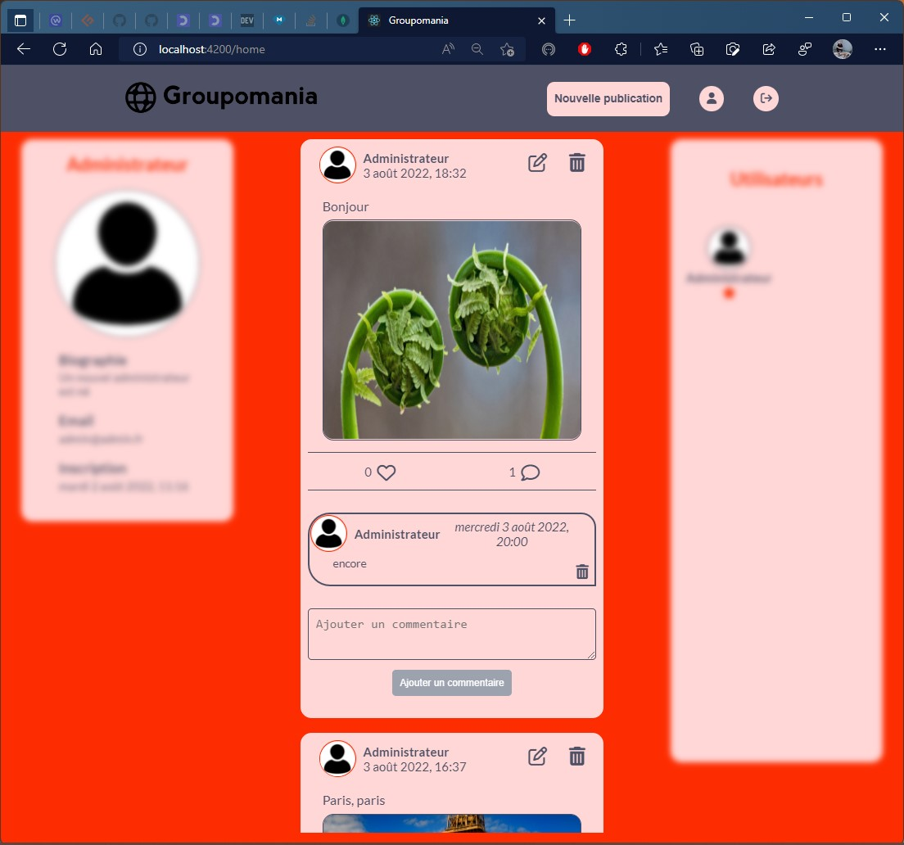

# P7_Creez_un_reseau_social_d’entreprise

Vous pouvez retrouver le [brief complet ici](https://course.oc-static.com/projects/DWJ_FR_P7/Cahier+charges+Groupomania.pdf)

## Réalisation

Le projet consiste à construire un réseau social interne pour les employés de Groupomania. Le but de cet outil est de faciliter les interactions entre collègues. Le département RH de Groupomania a imaginé plusieurs fonctionnalités pour favoriser les échanges entre collègues.

# Objectifs

1. Développer la partie backend
2. Dévellopper la partie Frontend

## INSTALLATION ##

Créer un dossier vide. Il contiendra le code complet du projet, regroupé dans deux dossiers : un dossier `api` et un dossier `client`.

## 1. Installation du site ####
 
Ouvrez un terminal:
 
Depuis le dossier précédement créé, clonez le repository de l'application groupomania avec la commande :
 
<pre><code>git clone https://github.com/Nathom78/P7_Creez_un_reseau_social_d-entreprise_LECOMTE_Thomas.git</code></pre>

ou depuis  [ce repository](https://github.com/Nathom78/P7_Creez_un_reseau_social_d-entreprise_LECOMTE_Thomas.git)
 
## 2. Installation de l'API ####
 
Depuis le dossier "api" : 
Tapez la commande suivante : <pre><code> npm install </code></pre>

Créez un dossier `api\medias` dans api. Les images y seront stocké  (déja créer)

Dans le dossier `api\config` créer un fichier `.env` dans lequel seront renseignés vos identifiants de connexion à MongoDB et les différentes chaînes de cryptage :
<pre><code>
non besoin PORT = 3000 par défault sinon cela dépend de votre frontend  pour que le front puisse communiquer avec l'API.

JWT_KEY="chaîne de caractères aléatoire"
EMAIL_ENCRYPTION_KEY="chaîne de caractères aléatoire"
COOKIE_SIGN="chaîne de caractères aléatoire"

DB_ID="identifiant de connexion à la base de données"
DB_MDP="mot de passe de connexion à la base de données"
DB_ADDRESS="adresse de la base de donné" ex: @cluster0.afknvvw.mongodb.net/nom_de_la_database?retryWrites=true&w=majority

# Token lifetime (milliseconds)
TOKEN_TIME_LIFE=3600000

</code></pre>

PS: J'ai mis à disposition un fichier user.json, exporté avec `STUDIO 3T`, afin d'importer l'administrateur dans votre base de donnée, vous pouvez le trouver :
- `client\public\users.json`

Puis lancez le serveur en tapant la commande :  <pre><code> `npm start`</code></pre>

Vous devriez voir 
<pre><code> MongoDB Connected 👌</code></pre>

Le serveur doit fonctionner sur [`http://localhost:3000/`](http://localhost:3000/).

## Installation - Frontend 
 
Puis depuis le dossier `client` :
Ouvrez un terminal et tapez la commande suivante : <pre><code> npm install </code></pre>

Puis lancez le front en tapant la commande : <pre><code> `npm start`</code></pre>
 
Rendez-vous sur [`http://localhost:4200/`](http://localhost:4200/). L'application va se recharger automatiquement si vous modifiez un fichier source
 
## Technologies

    
## Annexe. Création d'une base de données noSQL MongoDB

Rendez-vous sur le site de [MongoDb](https://account.mongodb.com/) et créez un compte.

Une fois le compte créé, créez votre base de données en veillant à la configurer de sorte à ce que l'utilisateur puisse exécuter l'application sur sa propre machine :
<pre>Network Access -> Allow access from anywhere</pre>

Une fois la base de données créé, vous devriez avoir :
- Un identifiant de connexion à la base de données
- Un mot de passe de connexion à la base de données
- une adresse pour accéder à la base afin de se connecter qui peux se trouver dans Deployment -> Cluster -> Connect -> connect your application : 
(de type mongodb+srv://<username>:<password>@cluster0.afknvvw.mongodb.net/<nom_de_la_database>?retryWrites=true&w=majority) où <nom_de_la_database> est le nom si une de crée manuellement sinon par defaut c'est vierge.

